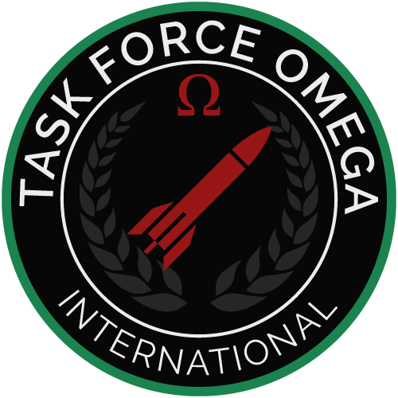

TFO Anti-Air Guide (VAR)

## Foreword :

This guide aims to assist the Anti-Air role in aircraft recognition and identification. It provides information on current operational aircraft which may be observed in diverse Arma III missions.

This guide is based on the following mods : **CFP, CUP, RHS, AMF, 3CB Factions, HAFM**

Source : https://irp.fas.org/doddir/army/fm3-01-80.pdf

This does not replace actual Anti-Air training and doesn’t grant the clearance for the role during missions.

## 1. Aircraft confusion

Confusing one aircraft with another is a serious problem that must be dealt with **Visual Aircraft Recognition** training. The following are the four types of confusion that can occur, of which the first two are the most dangerous :

When a **friendly** aircraft is recognized and identified as **hostile**. On a mission, this mistake could cause a friendly fire.

When a **hostile** aircraft is recognized and identified as **friendly**. During hostilities, this action might **allow a hostile aircraft entry into the defended area.**

When a **hostile** aircraft is recognized and identified as another hostile aircraft. Actions taken against hostile aircraft in combat are the same, so generally there is no impact. However, this situation could have an impact if **friendly factions were flying some aircraft types that are normally considered hostile.**

When a **friendly** aircraft is recognized and identified as another **friendly** aircraft. The actions taken in combat are the same, and there would be an impact only if a **hostile faction was using an aircraft type that is normally considered friendly.**

The human factor is a big part of aircraft confusion, it can include : lack of knowledge, lack of/or no communication, panic, trigger happiness…

  

    
    
UH-1Y Venom

  

  

    
    
CH-146 Griffon

  

  

    
    
F/A-181 Black Wasp II

  

  

    
    
MiG-29
 
  

##  2. Camouflages and markings

### Camouflages :

Combat aircraft usually have a **camouflage finish** with the upper and side surfaces painted in a **disruptive pattern of two or more shades.** This breaks up their form when viewed from above, and aids **concealment when on the ground or flying low.** The undersurfaces are **painted in a light color to blend with the sky** when viewed from below.
The **overall gray color** of most fighter-interceptor aircraft is a camouflage scheme. Other aircraft may be painted a two-tone gray. 

Light aircraft and helicopters will also be camouflage painted in **most cases**, but may be painted an **overall drab color**.

Camouflage will vary between **theaters of operation and/or Faction.**

  

    
    
Su-25 - RU

  

  

    
    
Mi-8 - ANA

  

  

    
    
L-39 - ADA

  

  

    
    
NH90 - HAF

  

  

    
    
JAS 39 - AAF

  

  

    
    
Mi-24 - CDF

  

## Camouflages hard to distinguish :

A small number of vehicles are used by a lot of different factions, especially aircrafts coming from USSR/Russia where the export of those was very important. This will increase the difficulty in the identification of the faction when both friendlies AND hostiles are using the same aircrafts with similar camouflages. 

Here are a few examples of different factions using similar, if not, same camo.

Su-25 :

  

    
    
RU

  

  

    
    
IA

  

  

  

    
    
RU - ChDSZ - chDKZ - chDZZ

  

  
  
RU - ChDSZ - chDKZ - chDZZ

  

    
    
AA

  

  

    
    
KDF

  

  

    
    
IA

  

  

    
    
SuAF

  

Mi-8 :

## to do
Mi-24 :

## to do

### Markings :

Painted markings and annotations can also be found on aircraft and helicopters, primarily for identification, making the visual recognition easier. Aircraft markings can includes :

Military aircraft insignia, applied to military aircraft to identify the nation or branch of military service.
Aircraft registration, unique alphanumeric string that identifies every aircraft.
Logo, emblem used by a company or organization.
Invasion stripes, alternating black and white bands painted on the fuselages and wings (WWII).
Art, decorative painting or design on the fuselage of an aircraft.
Tail code, help to identify the unit and base assignment.

This List of air forces provides the markings used by each military organization.

When multiple Factions use the same type of aircraft (ex. MI-8: Russia, Chernarus, ANA, Takistan…), the markings (if not the camo) may be the only way to discern between friendly and enemy (see examples here).

## to do

##  3. MANPADS

As infantry, you will be carrying MANPADS (Man-Portable Air-Defense Systems) on the field.
Depending on the model, the minimum and maximum engagement range will differ (see table below), but the locking system remains the same and usually is done automatically when aiming at a target.

It is important to identify your target and his specifications before any engagement, and to communicate with your squad leader, as targets like medevacs are not allowed to be engaged for exemple, which could result in a war crime.

It is your responsibility to obtain information from the Zeus about what aircraft friendly and hostile forces are using in the mission / campaign.

Here a non-exhaustive list of MANPADS available in Arma III : 

| N° | Mod      | Weapon                        | Min. range | Max. range |
| :-:| -------- | ----------------------------- | ---------- | ---------- |
| 1  | RHS AFRF | 9K38 Igla                     | 300 m      | 4800 m     |
| 2  | RHS USAF | FIM-92F                       | 300 m      | 6500 m     |
| 3  | RHS USAF | FGM-148 Javelin               | 100 m      | 2500 m     |
| 4  | CUP      | Igla 9K38                     | 100 m      | 5200 m     |
| 5  | CUP      | 9K32 Strela-2                 | 250 m      | 3700 m     |
| 6  | CUP      | FIM-92F Stinger  (single use) | 100 m      | 6000 m     |
| 7  | CUP      | FGM-148 Javelin               | 100 m      | 2400 m     |
| 8  | Vanilla  | Titan MPRL                    | 100 m      | 3500 m     |

##  4. Aircrafts

    This chapter shows a non-exhaustive list of Aircrafts.

Aircrafts will perform a variety of missions: **CAS, ground attack, transport, cargo, gunship** and **air superiority**. 

One aircraft was selected from each group to be represented in this manual, as some have different variants available.

For each, there is a picture, general data, user factions and game information.

Pictures are **not to scale**.

### A-7H Corsair II

  

**Country of origin** :  USA

**Side** :       

**Faction** : HAF

**Crew** : 1

**Role** : CAS, Ground Attack

**Armament** : Cannon, Bombs, Missiles, Rockets

**Variant** : None

**DLC/mod** : HAFM

 
 
 
 

### A-10 Thunderbolt II / A-164 Wipeout

  

**Country of origin** :  USA

**Side** :       

**Faction** : NATO, US Army

**Crew** : 1

**Role** : CAS, Ground Attack

**Armament** : Cannon, Bombs, Missiles, Rockets

**Variant** : None

**DLC/mod** : Vanilla, CUP, RHS USAF

 
 
 
 

### A-29 Super Tucano

  

**Country of origin** :  Brazil

**Side** :       

**Faction** : HIDF

**Crew** : 2

**Role** : Light attack

**Armament** : Cannon, Bombs, Rockets

**Variant** : None

**DLC/mod** : RHS GREF

 
 
 
 

### A330 Airbus

  

**Place of origin** :  Europe

**Side** :       

**Faction** : Civilian

**Crew** : 2

**Role** : Airliner

**Armament** : None

**Variant** : None

**DLC/mod** : CUP

 
 
 
 

### Aero Commander 500

  

**Country of origin** :  USA

**Side** :       

**Faction** : ION, MDF, HIDF, Civilian

**Crew** : 2

**Role** : Light-transport

**Armament** : None

**Variant** : None

**DLC/mod** : 3CB Factions

 
 
 
 

### AN-2 Antonov

  

**Country of origin** :  USSR,  Poland

**Side** :       

**Faction** : FIA, ADA, AA, ChDSZ, TNA, CDF, USSR, Civilian

**Crew** : 2

**Role** : Light-transport, Light attack

**Armament** : Usually none, Bombs, Rockets, Machine guns

**Variant** : None

**DLC/mod** : CUP, RHS GREF

 
 
 
 

### AV-8B Harrier II

  

**Country of origin** :  USA,  UK

**Side** :       

**Faction** : USMC, BAF, AAF

**Crew** : 1

**Role** : VSTOL fighter, CAS

**Armament** : Cannon, Bombs, Missiles, Rockets, Gun pods

**Variant** : None

**DLC/mod** : CUP

 
 
 
 

### Boeing 737

  

**Country of origin** :  USA

**Side** :       

**Faction** : Civilian

**Crew** : 2

**Role** : Airliner

**Armament** : None

**Variant** : None

**DLC/mod** : CUP

 
 
 
 

### C-130J Super Hercules

  

**Country of origin** :  USA

**Side** :       

**Faction** : AAF, ANA, ADA, US Army, LDF, MDF, TNA, UN, BAF, HAF, IDF, USMC, USAF, IRIA, SuAF, RACS

**Crew** : 2

**Role** : Transport, Cargo, Airdrop

**Armament** : None

**Variant** : AC-130 (gunship)

**DLC/mod** : CUP, RHS USAF, HAFM

 
 
 
 

### Cessna 172 Skyhawk

  

**Country of origin** :  USA

**Side** :       

**Faction** : ION, LFR, UN, Civilian

**Crew** : 2

**Role** : Light transport

**Armament** : None

**Variant** : T-41 Mescalero (military version)

**DLC/mod** : CUP, 3CB Factions

 
 
 
 

### Cessna 400 / Cessna TTx / Caesar BTT 

  

**Country of origin** :  USA

**Side** :       

**Faction** : AAF, ADA, AA, FIA, ION, LDF, LFR, MDF, NAPA, UN, Syndikat, Civilian

**Crew** : 2

**Role** : Light transport

**Armament** : None

**Variant** : None

**DLC/mod** : APEX DLC

 
 
 
 

### CASA CN-235

  

**Country of origin** :  Spain,  Indonesia

**Side** :       

**Faction** : FRA

**Crew** : 2

**Role** : Transport

**Armament** : None

**Variant** : None

**DLC/mod** : AMF

 
 
 
 

### Douglas C-47 Skytrain 
 

**Country of origin** :  USA

**Side** :       

**Faction** : US Army, KRG, TNA, HIDF

**Crew** : 2

**Role** : Transport, Cargo, Light attack

**Armament** : Usually none, Bombs

**Variant** : 
- Douglas DC-3 (civilian version), 
- AC-47 (gunship)
- Lisunov Li-2 (USSR version)

**DLC/mod** : CUP, 3CB Factions

 
 
 
 

### Douglas DC-3

**Country of origin** :  USA

**Side** :       

**Faction** : Civilian

**Crew** : 2

**Role** : Transport, Cargo

**Armament** : None

**Variant** : 
- Douglas C-47 (military version), AC-47 (gunship)
- Lisunov Li-2 (USSR version)

**DLC/mod** : CUP, 3CB Factions

 
 
 
 

### F-4 PHANTOM II

**Country of origin** :  USA

**Side** :       

**Faction** : HAF

**Crew** : 2

**Role** : Fighter-bomber, CAS

**Armament** : Cannon, Bombs, Missiles, Rockets

**Variant** : None

**DLC/mod** : HAFM

 
 

### F-16 FIGHTING FALCON

**Country of origin** :  USA

**Side** :       

**Faction** : HAF

**Crew** : 1,   F-16D : 2

**Role** : Multi-role ground-attack/fighter

**Armament** : Cannon, Bombs, Missiles, Rockets

**Variant** : F-16D Block 52+ (two-seater version)

**DLC/mod** : HAFM

 
 

### F/A-181 Black Wasp II

**Country of origin** :  USA

**Side** :       

**Faction** : NATO

**Crew** : 1

**Role** : Stealth, Multi-role/air-superiority fighter

**Armament** : Cannon, Bombs, Missiles, Rockets

**Variant** : Stealth

**DLC/mod** : Jets DLC

 
 

### F-22 Raptor

**Country of origin** :  USA

**Side** :       

**Faction** : USAF

**Crew** : 1

**Role** :  Stealth, Air Superiority Fighter, ground-attack

**Armament** : Cannon, Missiles

**Variant** : None

**DLC/mod** : RHS USAF

 
 

### F-35 Joint Strike Fighter

**Country of origin** :  USA

**Side** :       

**Faction** : US Army, USMC, BAF, IDF

**Crew** : 1

**Role** : VSTOL Fighter, Strike

**Armament** : Cannon, Bombs, Missiles, Rockets

**Variant** : None

**DLC/mod** : CUP

 
 

### JAS-39 Gripen / A-149 Gryphon

**Country of origin** :  Sweden

**Side** :       

**Faction** : HIL, AAF, LDF, RACS

**Crew** : 1

**Role** : Interceptor, Ground attack

**Armament** : Cannon, Bombs, Missiles

**Variant** : None

**DLC/mod** : Vanilla

 
 

### L-39 Albatros / L-159 ALCA / A-143 Buzzard

**Country of origin** :  Czechoslovakia

**Side** :       

**Faction** : AAF, ANA, ADA, KRG, LDF, TNA, ACR, CDF, SAA, TA

**Crew** : 1,   L-39ZA : 2

**Role** : Light attack

**Armament** : Bombs, Missiles, Rockets, Gun pods

**Variant** : L-39ZA (two-seater version)

**DLC/mod** : CUP, RHS GREF

 
 

### MD-454 Mystère

**Country of origin** :  France

**Side** :       

**Faction** : MDF, HIDF

**Crew** : 1

**Role** : Fighter-bomber

**Armament** : Cannon, Bombs, Missiles, Rockets

**Variant** : None

**DLC/mod** : 3CB Factions

 
 

### MiG-21 FISHBED

**Country of origin** :  USSR

**Side** :       

**Faction** : GAF, KDF, LDF, TNA, USSR, CDF, AA

**Crew** : 1

**Role** : Ground-attack, Interceptor

**Armament** : Cannon, Bombs, Missiles, Rockets

**Variant** : None

**DLC/mod** : 3CB Factions

 
 

### MiG-29 Fulcrum

**Country of origin** :  USSR

**Side** :       

**Faction** : ADA, AA, GAF, KDF, LDF, CDF, AAF, USSR, TNA, RU, SAF

**Crew** : 1

**Role** : Ground attack, Counter air fighter

**Armament** : Cannon, Missiles, Rockets

**Variant** : L-18 (Serbian version)

**DLC/mod** : RHS AFRF, RHS SAF

 
 

### Mirage 2000

**Country of origin** :  France

**Side** :       

**Faction** : FRA, HAF

**Crew** : 1

**Role** : Fighter-bomber, Interceptor

**Armament** : Cannon, Bombs, Missiles, Rockets

**Variant** : Mirage 2000EG (Greek export version)

**DLC/mod** : AMF, HAFM

 
 

### MV-22 Osprey

**Country of origin** :  USA

**Side** :       

**Faction** : USMC

**Crew** : 2,   3 with ramp gun

**Role** : VSTOL transport, Cargo

**Armament** : None, Ramp gun

**Variant** : None

**DLC/mod** : CUP

 
 

### Rafale C

**Country of origin** :  France

**Side** :       

**Faction** : FRA

**Crew** : 1,   Rafale B : 2

**Role** : Multi-role fighter

**Armament** : Cannon, Bombs, Missiles

**Variant** : M (carrier version), B (two-seater version)

**DLC/mod** : AMF

 
 

### Su-25 Frogfoot

**Country of origin** :  USSR

**Side** :       

**Faction** : ADA, AA, ChDSZ, GAF, KDF, LDF, TNA, CDF, CAF, CSAT, AAF, USSR, IA, KPA, RU, SLA, SuAF, TA, SAA

**Crew** : 1

**Role** : CAS, ground-attack

**Armament** : Cannon, Bombs, Missiles, Rockets

**Variant** : None

**DLC/mod** : CUP, RHS AFRF, RHS GREF

 
 

### Su-34 Fullback

**Country of origin** :  USSR

**Side** :       

**Faction** : CDF, CSAT, RU, SLA, AAF

**Crew** : 2

**Role** : Multi-role/air-superiority fighter

**Armament** : Cannon, Bombs, Missiles, Rockets

**Variant** : None

**DLC/mod** : CUP

 
 

### T-41 Mescalero

**Country of origin** :  USA

**Side** :       

**Faction** : AAF, Us Army, FIA, ION, KRG, MDF, TNA, UN, HIL, LDF, RACS

**Crew** : 2

**Role** : Light transport, Light attack

**Armament** : Bombs, Rockets, Machine guns

**Variant** : Cessna 172 Skyhawk (civilian/transport version)

**DLC/mod** : CUP, 3CB Factions

 
 

### T-50 (Su-57) Felon

**Country of origin** :  Russia

**Side** :       

**Faction** : RU

**Crew** : 1

**Role** : Stealth, Multi-role fighter

**Armament** : Cannon, Missiles

**Variant** : None

**DLC/mod** : RHS AFRF

 
 

### To-201 Shikra

**Country of origin** :  Russia,  CSAT

**Side** :       

**Faction** : CSAT

**Crew** : 1

**Role** : Stealth, Multi-role/air-superiority fighter

**Armament** : Cannon, Bombs, Missiles

**Variant** : Stealth

**DLC/mod** : Jets DLC

 
 

### Tu–95 BEAR

**Country of origin** :  USSR

**Side** :       

**Faction** : RU, USSR

**Crew** : 7

**Role** : Strategic bomber

**Armament** : Cannon, Bombs, Missiles

**Variant** : None

**DLC/mod** : RHS AFRF

 
 

### V-44X Blackfish

**Country of origin** :  USA

**Side** :       

**Faction** : NATO

**Crew** : 1

**Role** : VSTOL transport

**Armament** : None

**Variant** : Vehicle transport, Gunship

**DLC/mod** : Apex DLC

 
 

### Y-32 Wi’an

**Country of origin** :  CSAT

**Side** :       

**Faction** : CSAT

**Crew** : 2

**Role** : VSTOL transport, Gunship

**Armament** : Cannon, Bombs, Missiles, Rockets

**Variant** : Vehicle transport

**DLC/mod** : Apex DLC

 
 

### Yak-130 / To-199 Neophron

**Country of origin** :  CSAT

**Side** :       

**Faction** : CSAT, SAA

**Crew** : 1

**Role** : CAS, Ground-attack

**Armament** : Cannon, Bombs, Missiles, Rockets

**Variant** : None

**DLC/mod** : Vanilla

 
 

##  5. Helicopters

    This chapter shows a non-exhaustive list of Helicopters.

Aircrafts will perform a variety of missions: transport, cargo, attack, medevac, rescue and utility. 

One helicopter was selected from each group to be represented in this manual, as some have different variants available.

For each, there is a picture, general data, user factions and game information.

Pictures are **not to scale**.

### AH-1Z Viper

**Country of origin** :  USA

**Side** : 

**Faction** : USMC, AAF

**Crew** : 2

**Role** : Attack helicopter

**Armament** : Cannon, Missiles, Rockets

**Variant** : None

**DLC/mod** : CUP, RHS USAF

### AH-6M Little Bird / AH-9 Pawnee

**Country of origin** :  USA

**Side** : 

**Faction** : NATO, US Army, KeDF, ION, IDF, RACS, Syndikat

**Crew** : 2

**Role** : Light attack

**Armament** : Missiles, Rockets, Gun pods, Machine guns

**Variant** : 
- MH-6M / MH-9 (transport version)
- MD 500 / M-900 (vanilla version)

**DLC/mod** : Vanilla, CUP, RHS USAF

### AH-64 / AH1 Apache

**Country of origin** :  USA

**Side** : 

**Faction** : US Army, BAF, IDF

**Crew** : 2

**Role** : Attack helicopter

**Armament** : Cannon, Missiles, Rockets

**Variant** : None

**DLC/mod** : CUP, RHS USAF, HAFM

### AS532 Cougar

**Country of origin** :  France

**Side** : 

**Faction** : FRA

**Crew** : 2

**Role** : Transport

**Armament** : None

**Variant** : None

**DLC/mod** : AMF

### AS565 Panther

**Country of origin** :  France

**Side** : 

**Faction** : FRA

**Crew** : 2

**Role** : Light transport

**Armament** : None

**Variant** : None

**DLC/mod** : AMF

### AW159 Wildcat / WY-55 Hellcat

**Country of origin** :  Brazil

**Side** : 

**Faction** : BAF, HIL, AAF

**Crew** : 2

**Role** : Light attack, Light transport

**Armament** : None, Missiles, Rockets, Gun pods, Machine guns

**Variant** : None

**DLC/mod** : Vanilla, CUP

### Bell 412

**Country of origin** :  USA

**Side** : 

**Faction** : APD, ION, LFR, Civilian, IDAP

**Crew** : 2,    3 with commander

**Role** : Transport, Medevac, Rescue, VIP

**Armament** : None

**Variant** : CH-146 Griffon (military version)

**DLC/mod** : CUP, 3CB Factions

### CH-47 / HC-4 Chinook

**Country of origin** :  USA

**Side** : 

**Faction** : NATO, US Army, BAF, HAF, HIL, RACS

**Crew** : 4

**Role** : Transport, Cargo

**Armament** : Machine guns

**Variant** : None

**DLC/mod** : CUP, RHS USAF, HAFM

### CH-47I Chinook / CH-67 Huron

**Country of origin** :  USA

**Side** : 

**Faction** : NATO

**Crew** : 2,   4 with gunners

**Role** : Transport, Cargo

**Armament** : None, Machine guns

**Variant** : None

**DLC/mod** : Helicopters DLC

### CH-53E Super Stallion

**Country of origin** :  USA

**Side** : 

**Faction** : US Army, GER, IDF, USMC

**Crew** : 2,   GAU-21 : 3

**Role** : Transport, Cargo

**Armament** : None, Ramp gun

**Variant** : None

**DLC/mod** : CUP, RHS USAF

### CH-146 Griffon

**Country of origin** :  USA,  Canada

**Side** : 

**Faction** : AAF, ION, KRG, MDF, TNA, UN, CDF, HIDF, HIL, FIA

**Crew** : 2,    3 with commander,    5 with gunners

**Role** : Light attack, Transport, Medevac

**Armament** : Missiles, Rockets, Gun pods, Machine guns

**Variant** : Bell 412 (utility version)

**DLC/mod** : CUP, 3CB Factions

### EC665 Tiger

**Country of origin** :  France,  Germany

**Side** : 

**Faction** : FRA

**Crew** : 2

**Role** : Attack helicopter

**Armament** : Cannon, Missiles, Rockets

**Variant** : None

**DLC/mod** : AMF, R3F

### H225M Caracal

**Country of origin** :  France

**Side** : 

**Faction** : FRA

**Crew** : 4

**Role** : Transport, Cargo

**Armament** : Machine guns

**Variant** : None

**DLC/mod** : AMF

### Ka-50 Black Shark

**Country of origin** :  USSR

**Side** : 

**Faction** : RU, SLA

**Crew** : 1

**Role** : Attack helicopter

**Armament** : Cannon, Bombs, Missiles, Rockets, Gun pods

**Variant** : None

**DLC/mod** : CUP

### Ka-52 Alligator

**Country of origin** :  Russia

**Side** : 

**Faction** : RU

**Crew** : 2

**Role** : Attack helicopter

**Armament** : Cannon, Bombs, Missiles, Rockets, Gun pods

**Variant** : None

**DLC/mod** : CUP, RHS AFRF

### Ka-60 Kasatka

**Country of origin** :  Russia

**Side** : 

**Faction** : CSAT, RU, AAF, ION, KeDF 

**Crew** : 2,   3 with gunner

**Role** : Transport, Light attack

**Armament** : None, Missiles, Rockets, Gun pods, Machine guns

**Variant** : Harbin ZB9 (Chinese version)

**DLC/mod** : Vanilla, CUP, RHS AFRF

### Merlin HC3 / EH101 /  CH-49 Mohawk

**Country of origin** :  Italy

**Side** : 

**Faction** : BAF, ION, AAF, Civilian, IDAP

**Crew** : 2,   3 with ramp gun,   4 with rescue crew

**Role** : Transport, Medevac, VIP, Rescue

**Armament** : None, Ramp gun

**Variant** : None

**DLC/mod** : Vanilla, CUP, RHS USAF

### MH-47E / HC-6 Chinook

**Country of origin** :  USA

**Side** : 

**Faction** : US Army, BAF

**Crew** : 4

**Role** : Transport, Cargo

**Armament** : Machine guns

**Variant** : None

**DLC/mod** : CUP

### Mi-6A Hook

**Country of origin** :  USSR

**Side** : 

**Faction** : CDF, CSAT, CMRS, RU, SLA, TA, UN, Civilian

**Crew** : 5

**Role** : Transport, Cargo

**Armament** : Cannon, Bombs, Rockets

**Variant** : None

**DLC/mod** : CUP

### Mi-8 Hip

**Country of origin** :  USSR

**Side** : 

**Faction** : ANA, ADA, AA, ChDZS, CPD, GAF, KDF, LDF, TNA, UN, AfghA, CDF, CAF, NA, CIA, AAF, ChDKZ, USSR, CMRS, IA, IRIA, KPA, Wagner, Russia, SLA, SAF, SuAF, ChDZZ, UPDF, Civilian

**Crew** : 2,   4 with Gunners

**Role** : Transport, Cargo, Light attack

**Armament** : None, Rockets, Machine guns

**Variant** : 
- HT-40 / HT48 (Serbian version)
- Mi-17 (export version)

**DLC/mod** : CUP, RHS AFRF, RHS GRF

### Mi-24 / Mi-35 Hind

**Country of origin** :  USSR,  South Africa (Mi-24G) 

**Side** : 

**Faction** : ANA, ADA, AA, GAF, KDF, LDF, TNA, UN, AfghA, CDF, CAF, IA, NA, UPDF, CSAT, AAF, USSR, RU, KPA, Wagner, SLA, SuAF, TA, SSPDF, ACR, MGF, ION

**Crew** : 2

**Role** : Light transport, Attack helicopter

**Armament** : Cannon, Bombs, Missiles, Rockets

**Variant** : 
- P (fix 20mm cannon), 
- D / V (12.7mm turret), 
- G / Mk.III / Mk.IV (20mm turret),
- Mi-35 (export version)

**DLC/mod** : CUP, RHS AFRF, RHS GREF
### Mi-28N Havok

**Country of origin** :  Russia

**Side** : 

**Faction** : RU

**Crew** : 2

**Role** : Attack helicopter

**Armament** : Cannon, Bombs, Missiles, Rockets, Gun pods

**Variant** : None

**DLC/mod** : RHS AFRF

### Mi-48 Kajman

**Country of origin** :  Russia,  CSAT

**Side** : 

**Faction** : CSAT

**Crew** : 2

**Role** : Light transport, Attack helicopter

**Armament** : Cannon, Bombs, Missiles, Rockets, Gun pods

**Variant** : None

**DLC/mod** : Vanilla

### Mi-290 Taru

**Country of origin** :  CSAT

**Side** : 

**Faction** : CSAT

**Crew** : 2

**Role** : Transport, Cargo, Medevac, Utility

**Armament** : None

**Variant** : None

**DLC/mod** : Helicopters DLC

### NH90 Caïman

**Country of origin** :  France

**Side** : 

**Faction** : FRA, HAF, FIN

**Crew** : 2,   4 with gunners

**Role** : Transport, Cargo

**Armament** : None, Machine guns

**Variant** : None

**DLC/mod** : AMF, HAFM

### OH-58D Kiowa

**Country of origin** :  USA

**Side** : 

**Faction** : HAF

**Crew** : 2

**Role** : Light attack

**Armament** : Cannon, Rockets

**Variant** : None

**DLC/mod** : HAFM

### RAH-66 Comanche / AH-99 Blackfoot

**Country of origin** :   USA

**Side** : 

**Faction** : NATO

**Crew** : 2

**Role** : Attack helicopter

**Armament** : Cannon, Missiles, Rockets

**Variant** : None

**DLC/mod** : Vanilla

### SA-330 Puma

**Country of origin** :  France,  UK

**Side** : 

**Faction** : BAF, KeDF, MGF, RACS

**Crew** : 2

**Role** : Transport

**Armament** : None

**Variant** : None

**DLC/mod** : CUP

### SA-340 Gazelle

**Country of origin** :  France,  UK

**Side** : 

**Faction** : FRA

**Crew** : 2

**Role** : Light attack

**Armament** : Rockets, Gun pods

**Variant** : None

**DLC/mod** : AMF

### UH-1H Huey

**Country of origin** :  USA

**Side** : 

**Faction** : FIA, AAF, ANA, ADA, US Army, ION, KRG, MDF, TNA, UN, GER, HIDF, CIA, SLA, TA, CFD, RACS, IDAP

**Crew** : 2,   4 with door gunners

**Role** : Transport, Light attack, Medevac

**Armament** : None, Rockets, Machine guns

**Variant** : Unarmed, Door gunners, Rocket pods

**DLC/mod** : CUP, RHS GREF, 3CB Factions

### UH-1Y Venom

**Country of origin** :  USA

**Side** : 

**Faction** : USMC

**Crew** : 2,   4 with door gunners

**Role** : Transport, Light attack, Medevac

**Armament** : None, Rockets, Machine guns

**Variant** : None

**DLC/mod** : CUP, RHS USAF

### UH-60 Black Hawk

**Country of origin** :  USA

**Side** : 

**Faction** : AAF, ANA, US Army, AfghA, IDF, RACS

**Crew** : 2,   4 with gunners

**Role** : Transport, Medevac

**Armament** : None, Rockets, Machine guns

**Variant** : MH-60 (navy version)

**DLC/mod** : CUP, RHS USAF

### UH-80 Ghost Hawk

**Country of origin** :   USA

**Side** : 

**Faction** : NATO, CTRG

**Crew** : 4

**Role** : Stealth, Transport

**Armament** : Machine guns

**Variant** : None

**DLC/mod** : Vanilla

## 6. UAV

    This chapter shows a non-exhaustive list of Unmanned Aerial Vehicles.

UAVs will perform a variety of missions: reconnaissance, surveillance, intelligence, targeting, and acquisition. 

One UAV was selected from each group to be represented in this manual.

For each, there is a picture, general data, user factions and game information.

Pictures are **not to scale**.

 

### AR-2 Darter / Tayran

**Country of origin** :  Unknown

**Side** : 

**Faction** : NATO, CSAT, AAF, LDF, IDAP

**Crew** : 0

**Role** : Reconnaissance, Surveillance, Laser targeting

**Armament** : Laser Designator

**Variant** : None

**DLC/mod** : Vanilla

### AL-6 Pelican / Jinaah

**Country of origin** :  Unknown

**Side** : 

**Faction** : NATO, CSAT, AAF, LDF, Civilian, IDAP

**Crew** : 0

**Role** : Supply transport

**Armament** : None

**Variant** : Medical, Demining

**DLC/mod** : Laws of War DLC

### KH-3A Fenghuang

**Country of origin** :  China

**Side** : 

**Faction** : CSAT

**Crew** : 0

**Role** : Observation, Laser targeting, Air-to-ground fire support

**Armament** : Missiles, Laser Designator

**Variant** : None

**DLC/mod** : Apex DLC

### MQ-4A Greyhawk

**Country of origin** :  USA

**Side** : 

**Faction** : NATO, CSAT, AAF

**Crew** : 0

**Role** : Observation, Laser targeting, Air-to-ground fire support

**Armament** : Bombs, Missiles, Laser Designator

**Variant** : None

**DLC/mod** : Vanilla

### MQ-9 Reaper

**Country of origin** :  USA

**Side** : 

**Faction** : US Army, IDF, FRA

**Crew** : 0

**Role** : Observation, Laser targeting, Air-to-ground fire support

**Armament** : Bombs, Missiles, Laser Designator

**Variant** : None

**DLC/mod** : CUP, AMF, 3CB BAF, USAF Mod

### MQ-12 Falcon

**Country of origin** :  USA

**Side** : 

**Faction** : NATO

**Crew** : 0

**Role** : Observation, Laser targeting, Air-to-ground fire support

**Armament** : Missiles, Rockets, Laser Designator

**Variant** : None

**DLC/mod** : Apex DLC

### Pchela-1T / SHMEL-1 / YAK-061

**Country of origin** :  CIS

**Side** : 

**Faction** : CDF, Russia, Wagner

**Crew** : 0

**Role** : Remote terrain observation

**Armament** : None

**Variant** : None

**DLC/mod** : CUP, RHS AFRF

### Pegasus II

**Country of origin** :  Greece

**Side** : 

**Faction** : HAF

**Crew** : 0

**Role** : Reconnaissance, Surveillance

**Armament** : None

**Variant** : None

**DLC/mod** : HAFM

### UCAV Sentinel

**Country of origin** :  USA

**Side** : 

**Faction** : NATO

**Crew** : 0

**Role** : Observation, Laser targeting, Close air support, SEAD

**Armament** : Bombs, Missiles, Laser Designator

**Variant** : None

**DLC/mod** : Jets DLC

## 7. Glossary

| Factions : |                                           |
| ---------- | ----------------------------------------- |
| AA         | Ardistan Army                             |
| AAF        | Altis Armed Forces                        |
| ACR        | Army of the Czech Rep.                    |
| ADA        | African Desert Army                       |
| AfghA      | Afghanistan Army                          |
| ANA        | Afghanistan National Army                 |
| APD        | Altis Police Department                   |
| BAF        | British Armed Forces                      |
| CAF        | Chadian Armed Forces                      |
| CDF        | Chernarus Defence Forces                  |
| ChDKZ      | Chernarussian Movement of the Red Star    |
| ChDSZ      | Chernarussian Movement of the Blue Star   |
| ChDZZ      | Chernarussian Movement of the Green Star  |
| CIA        | Central Intelligence Agency               |
| CIS        | Commonwealth of Independent States        |
| CMRS       | Chernarussian Movement of the Red Star    |
| CPD        | Chernarus Police Department               |
| CSAT       | Canton Protocol Strategic Alliance Treaty |
| CTRG       | Combat Technology Research Group          |
| FIA        | Freedom and Independence Army             |
| FIN        | Finland Army                              |
| FRA        | French Army                               |
| GAF        | Grozovia Armed Forces                     |
| GER        | German Army                               |
| HAF        | Hellenic Armed Forces                     |
| HIDF       | Horizon Islands Defence Forces            |
| HIL        | Horizon Islands Legion                    |
| IA         | Iraqi Army (Hussein Regime)               |
| IDAP       | International Development & Aid Project   |
| IDF        | Israeli Defence Forces                    |
| ION        | ION Services                              |
| IRIA       | Islamic Republic of Iran Army             |
| KDF        | Kolgujev Defence Forces                   |
| KeDF       | Kenyan Defense Forces                     |
| KPA        | Korean People’s Army                      |
| KRG        | Karzeghistan Royal Guard                  |
| LDF        | Livonian Defence Forces                   |
| LFR        | Livonian Forest Rangers                   |
| MDF        | Malden Defence Forces                     |
| MGF        | Malian Government Forces                  |
| NA         | Nigerian Army                             |
| NAPA       | National Party                            |
| NATO       | North Atlantic Treaty Organization        |
| RACS       | Royal Army Corps of Sahrani               |
| RU         | Russian Army                              |
| SAA        | Syrian Arab Army                          |
| SAF        | Serbian Armed Forces                      |
| SuAF       | Sudanese Armed Forces                     |
| SLA        | Sahrani Liberation Army                   |
| SSPDF      | South Sudan People’s Defence Forces       |
| TA         | Takistan Army                             |
| TNA        | Takistan National Army                    |
| UN         | United Nations                            |
| UPDF       | Uganda People’s Defence Force             |
| USAF       | United States Air Force                   |
| US Army    | United States Army                        |
| USMC       | United States Marine Corps                |
| USSR       | Union of Soviet Socialist Republics       |

| Mods: |                                              |
| ----- | -------------------------------------------- |
| 3CB   | 3 Commando Brigade                           |
| AFRF  | (RHS) Armed Forces of the Russian Federation |
| AMF   | Arma Mod France                              |
| BAF   | (3CB) British Armed Forces                   |
| CFP   | Community Faction Project                    |
| CUP   | Community Upgrade Project                    |
| GREF  | (RHS) Green Forces                           |
| HAFM  | Hellenic Armed Forces Mod                    |
| RHS   | Red Hammer Studio                            |
| SAF   | (RHS) Serbian Armed Forces                   |
| USAF  | (RHS) United States Armed Forces             |