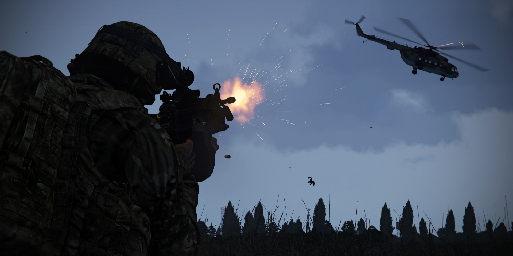

This is a guide to becoming an autorifleman in TFO. 

## Autorifleman Role
An autorifleman is a supportive role in a squad, serving as a strong suppressive force and can bring up to 80% of the Firepower of your Squad. To do this properly the AR has to shoot short bursts (5-6 rnds) in succession in the general direction of the enemy. This means that an AR doesn’t always have to aim at an enemy to shoot. An AR follows orders from their direct leader as expected and is usually requested to stay back to provide cover for the squad. Since the gear of an AR is quite heavy it’s harder to push into a position quickly.
An AR must set up in a location where they can deploy their bipod so they can fire properly.  They also must be in a safe enough location to support their squad without being knocked out themselves. So, an AR should get next to or behind a rock. An AR should be able to support their squad at medium range (0-400m) it is however possible to support from further, but this will decrease efficiency. 
An AR is meant for suppressing a large quantity of enemies at the same time. This means that an AR isn’t supposed to pick off enemies one-by-one.

## Positioning as an Autorifleman
An AR should be positioned near their squad or in an Overwatch position so he can provide covering fire and suppressive fire. The AR also needs a place with cover that they can use for mounting their gun. They should also use higher ground to their advantage when providing support to their squad. 
The AR needs vision of enemies, buildings with enemies or they have to know where shots are coming from so they can suppress those enemies. The AR can be left behind so they can support their squad from mid-range.
It’s very important for the AR to be safe as they are a key element of a squad. This means that an AR shouldn’t be out in the open too often and shouldn’t be clearing buildings. 

## Characteristics of Fire

### Trajectory
Describes the path of the Bullet in Flight. For most machineguns this path is pretty straight up to 300 meters, beyond to the trajectory curve as the Range increases due to Gravity.
### Maximum Ordinate
This is the highest Point the Trajectory reaches between the muzzle of the Weapon and the base of the Target.
### Cone of Fire
This is the pattern formed by the different trajectories in each burst as they travel downrange. Vibration of the weapon, variations in ammunition, and atmospheric conditions all contribute to the trajectories that make up the cone of fire.
### Danger Space
This is the space between th weapon and the Target where the trajectory does not rise above 1.8 meters.
Gunners should consider the Danger space of their weapon when planning overhead fire.
### Beaten Zone
This is the pattern formed by the rounds within the cone of fire striking the ground or the target. The size and shape of the beaten zone changes as a function of the range to and slope of the target. Gunners and automatic riflemen should engage targets to take maximum effect of the beaten zone. The simplest way to do this is to aim at the center base of the target. Most rounds will not fall over the target, and any that fall short will create ricochets into the target.
### Dead Space
Dead Space defines an area where the waist of a soldier falls below the Gunners point of aim.

## Techniques of Fire

### Direct Fire:
Gunners and automatic riflemen use the direct-lay technique by aligning the sights of the weapon on the target. This is the easiest and quickest means of delivering fire.
### Assault Fire:
Automatic riflemen use assault fire when in close combat. Assault fire involves firing without the aid of sights using the hip, shoulder, and underarm positions. The underarm position is best when rapid movement is required. In all three positions, automatic riflemen adjust their fire by observing the tracer and the impact of the bullets in the target area.
### Overhead Fire:
Gunners can use overhead fire when there is sufficient low ground between the machine gun and the target area for the maneuver of friendly forces. Gunners must accurately estimate range to the target and establish a safety limit that is an imaginary line, parallel to the target, where fire would cause casualties to friendly soldiers. Gun crews and leaders must be aware of this safety limit. Leaders must designate signals for lifting or shifting fires. Gunners should not attempt overhead fires if the terrain is level or slopes uniformly, if the barrel is badly worn, or if visibility is poor.
### Fire from Defilade Position:
Defilade positions protect gunners from frontal or enfilading fires. Cover and concealment may not provide the gunner a view of some or all of the target area. In this instance, some other member of the platoon must observe the impact of the rounds and communicate adjustments to the gunner. Gunners and leaders must consider the complexity of laying on the target, the gunner's inability to make rapid adjustments to engage moving targets, the ease with which targets are masked, and the difficulty in achieving grazing fires for a final protective line.

## Loadout

|Category             | Contents             |                     |
|---------------------|----------------------|---------------------|
| Primary weapon      | 5.56 LMG / 7.62 HMG  |                     |
| Primary ammo        | 800 rnd 5.56         |                     |
|                     | 500 rnd 7.62         |                     |
| Optic magnification | 1x-4x                |                     |
|                     |                      |                     |
|Throwables/explosives| **Day only**         | **Night Only**      |
|                     | 2x Frag              | 2x Frag             |
|                     | 3 white throwable    | 2-4x Blue Chemlight |
|                     |                      |                     |
| Medical             | 15x Packing          |                     |
|                     | 4x Tourniquets       |                     |
|                     | 1x Painkillers       |                     |
|                     | 1x Guedel tube       |                     |
|                     |                      |                     |
| Radio               | AN-343               |                     |
|                     |                      |                     |
| Misc                | 2 Cable ties         | IR strobe           |
|                     | Earplugs             |                     |
|                     | Entrenchment tool    |                     |

| **Gear**                      | **Explanation**                                                                                                                                                                                                                                 |
| ----------------------------- | ----------------------------------------------------------------------------------------------------------------------------------------------------------------------------------------------------------------------------------------------- |
| 5.56 LMG                      | This is the normal weapon for an AR. It’s usually lighter than it’s 7.62 counterpart.  These guns also usually allow for reloading 30rnd mags for when the AR is out of ammo. 5.56 Boxes usually have 200 rounds and weigh less than 7.62 boxes. |
| 7.62 HMG                      | This is a heavier variant of the 5.56 LMG. This 7.62x51 variant doesn’t allow for 30rnd mags to be loaded.   It also needs an ammobearer to carry ammo for the AR. 7.62 Boxes usually have 120-150rnds                                            |
| Bipod                         | Make sure your gun has a bipod as it allows you to set-up your gun properly so you can suppress more efficient.                                                                                                                                 |
| Scope with 1-4x magnification | The AR is allowed to have a 4x scope because they must be able to know where targets are more precisely so they can suppress better.                                                                                                            |

## Rates of Fire
Usually Automatic Rifleman fire in one of three ROF(Rates of Fire) each of which is usefull in different kinds of Situations from long Range Engagement to Close Quarters Combat in an Urban Environment.

### Rapid Rate:
-around 200 rounds per minute
-bursts of 4 to 5 rounds in 5 to 6 second intervalls
-usefull at Ranges from 300 meters up
### Sustained Rate:
-around 100 rounds per minute
-bursts of 6 to 9 rounds in 4 to 5 second intervalls
-usefull at Ranges from 300 to 100 meters
### Cyclic Rate:
Normal cyclic rate of fire is 650 to 850 rounds per minute.
In this type of ROF the Gunner holds the Trigger to the Rear until he either hasa to reload or his Teamleader calls cease Fire
Usefull at extreme close Range and up to a 100 meters.

## Fire Control

1. In offensive Operations
Includes Instructions to Initiate, Shift and Lift Fire.
2. In defensive Operations
Includes the presence and susequent action of friendly soldiers to the front of the position, as well as the iniiation and sequence of engagements, priotity targets and the shifting/displacing of fire in case of counterattacks.
3. Signals to initiate fire
Fire commands must be clear, are to be repeated by the Gunner or Autorifleman and have to contain the following elements:

-Who to Engage

-Direction of Fire

-Description of the Target to be Engaged

-Range

-Method of Fire

-Command to Open Fire

## Classifications of Automatic Fire

### Grazing Fire:
Automatic weapons achieve grazing fire when the center of the cone of fire does not rise more than 1 meter above the ground. When firing over level or uniformly sloping terrain, the SAW can attain a maximum of 600 meters of grazing fire.
### Plunging Fire:
Plunging fire occurs when weapons fire at long range, when firing from high ground to low ground, when firing into abruptly rising ground, or when firing across uneven terrain, resulting in a loss of grazing fire at any point along the trajectory.
### Enfilade Fire:
Enfilade fire occurs when the long axis of the beaten zone coincides or nearly coincides with the long axis of the target. It can be frontal or flanking. It is the most desirable class of fire with respect to the target because it makes maximum use of the beaten zone.
### Frontal Fire:
Frontal fire occurs when the long axis of the beaten zone is at a right angle to the front of the target.
### Flanking Fire:
Flanking fire is delivered directly against the flank of a target.
### Fixed Fire:
Fixed fire is delivered against a stationary point target when the depth and width of the beaten zone will cover the target.
### Traversing Fire:
Traversing distributes fires in width by successive changes in direction.
### Searching Fire
Searching distributes fires in depth by successive changes in elevation.

## Engaging Air Targets
This should only be done on your Squadleaders permission because in can consume a lot of ammo very fast.
In order to engage any Thread coming from the sky with a Machine Gun you'll need to roughly estimate the targets Airspeed in order to lead properly.
Once you have done that start leading in front of your target in the direction its heading and wait for your squadleader command to engage.
Upon receiving said command you stop leading and just hold down the Trigger letting the Target fly into your Hail of Lead. This is one of the only options Infantry has against Air Targets and should be done in unison with the rest of the Team to maximize Damage to your intended Target.

