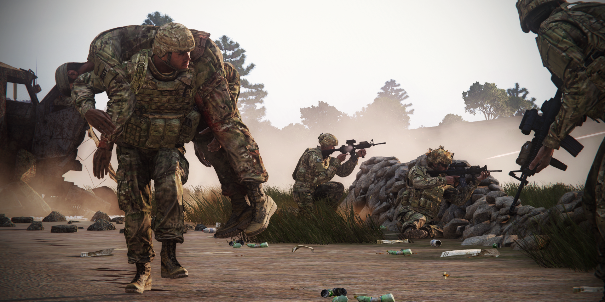

# Medic

This guide is written primarily for new medics, but should have enough info for even experienced medics to learn something. I understand many of this will not be carried out when the first bullets start flying, but try to keep any of it in the back of your head.

## Safety

Before providing any medical assistance one should always care about the safety for yourself first.

**This is one of the first and most important rule for any first responder in any field.**

You cannot help anyone if you're shot yourself; this means that you might also need to deal with the threat first, and provide medical assistance later.
Medical assistance should only be provided in a relatively safe spot; this means getting some hard cover between yourself and your enemy. 
Think of your environment like walls, hills and rocks but there is  also cover that you can create: think of vehicles and trenches. If there is no hard cover available nearby you can also use smokes grenades & bushes. 

*If all above is not possible, contact your squad leader/team leader.*

In order to remain in a safe position you are also going to need covering fire. Ask your battle mates for general support and cover.
I've seen countless scenarios where someone is shot and everyone rushes over to become a medic. Your job as a medic is to send them away as fast as possible and let them cover your position.

## Medics within TFO

As discussed above the role we call medic is a hybrid of a first responder and a paramedic. Because of this, there isn't a clear defined position within the squad like this within any army.
Therefore we can have our own interpretation of how this role can be used effectively.
As the unit continues to grow, some changes can occur to the CoC, and the medic role itself (new responsibilities, or even adding a new medic to the roster)

As of now, casualty collection point (CCP) is rarely used. We are looking forward to use this type of gameplay more in the future, where a clear medical team and chain of command is established.

Normally there would be different classes of medical personnel with different roles, bur for now, we stick with a platoon medic, and 1 to 3 combat life savers.

### Combat lifesaver (CLS)

This soldier is part of the squad and as the name suggests this is probably the first one to arrive at a wounded soldier.  His job is to stabilize the soldier as fast as possible,and  make sure they are either good to go or are stable enough to be medevac'd. 
 
A CLS is primarily a rifleman, but with more advanced medical training than everyone else. Meaning, he can be a first responder on the battlefield, to try to save and stabilize colleagues, until the medic arrives on scene.

Even with this training, the Combat Life Saver is not able to perform advanced medical procedures.

One of the roles of the CLS, is to support the medic is asked to, and return to combat as quickly as possible.

### Medic

This officer is part of the command structure and operates mostly behind the frontline. His primary job will be patching up soldiers back to full health so they are ready to be redeployed.

Due to the smaller size of Task Force Omega, we have chosen to let he medic be a part of the battle instead of having him behind the combat lines with a casualties collection point.
But as we are growing this might be coming in to play more.

It's recommended for all squad leaders to set up a casualty collection point before any attack. This would be  a location close to the frontline but away from any immediate danger. If squad size allows it, it is recommended to have at least one soldier here to cover the position. Any heavy casualties are to be brought here as fast as possible.

Ideally the medic would stick close to the platoon leader and would only leave his side when ordered to.

#### Evaluation phase

Alright, so the first bullets start flying and one of your fellow squad members got shot.

The first priority should be to call out who got shot and where to your squad leader. Sometimes squad leaders are in a much better position to rescue wounded soldiers than a medic. Right after this the evaluation phase starts: is the soldier simply wounded or unconscious as well?

- Wounded

Right after your figured out that the soldier is wounded another evaluation is in order: *Is the wounded soldier able to move to a safer spot himself?* This can be obstructed by for example heavy fire or being crippled by the wound.  

The answer to this question can easily be discovered by asking the wounded soldier if possible.

- Unconscious

Right after your figured out that the soldier is unconscious, another evaluation is in order: 
*Is the wounded soldier in an unsafe spot?* 
The first order of business is to get them out of there. 

Try dragging them to cover, or let someone close to the unconscious soldier do that for you. Picking someone up and carrying them over to a safe spot is usually a bad idea. The process of getting someone on your shoulders takes way too long under fire but carrying can be a good idea when you need to move an unconscious soldier from a position where you already have cover. 
A combination of both techniques can be applied as well, for example: Drag a wounded soldier from an unsafe position to cover followed up by picking them up and carrying them to a medic-post.

- Equipment:

In the following chapter we are going to discuss the actual medical processes. 
First we are going to discuss all the equipment you have available and after that we are going to discuss a few scenarios.

## CPR and AED-X-series (LifePak)

Let's start with the Wikipedia description for CPR:

“Cardiopulmonary resuscitation (CPR) is an emergency procedure that combines chest compressions often with artificial ventilation in an effort to manually preserve intact brain function until further measures are taken to restore spontaneous blood circulation and breathing in a person who is in cardiac arrest.”

CPR creates an Artificial circulation in the patient in case there is a cardiac arrest. So basically CPR is creating blood flow when the Patient's heart is unable to. 
It's also important noting that checking for a hard rate while CPR is going is always going to result in at least a low heart rate due to chest compressions. 
**Checking for a heart rate on a limb with tourniquets is useless and will result in no pulse.**

CPR by itself is not going to wake up an unconscious patient; a stable blood pressure is. Anyone can perform CPR and therefore as a medic you should assign someone else to do it. This will leave you to perform other medical assistance. 
To stabilize the wounds and restore blood pressure. CPR is only effective to restart the heart rate, after a patient has a heart rate (no matter how low) performing CPR is useless.
If a patient has no heartrate an invisible timer will start running, and you have 5 mins to get a heart rate going, or the patient dies.

Due to our server settings, the best way to do CPR is to push epinephrine (adrenaline), then do CPR 3 times, then check again for pulse.
Epinephrine is administrable by CLS or medics only, and you shouldn't more than 3 consecutively.

Also, CPR is used when the AED LifePak is not recommended (asystole). 
In case of Polymorphous ventricular tachycardia (PVT) or Ventricular Fibrillation (VF or Vfib), the use of the AED in mandatory

How to determine *Cardiac Arrest*
Start monitoring vitals using **AED X-series** and use “*check rhythm*” feature (available both in AED and AED X-series), or attach a **Pulse Oximeter** to a limb <u>**WITHOUT**</u> a tourniquet:

- “Shock advised” (**VFib/PVT**) - administer shock. Using epinephrine/amiodarone/lidocaine (always followed by a shock) in the order mentioned is advised after the first shock fails. Repeat starting from epinephrine if lidocaine fails.

- “No shock advised” (**Asystole**) - do not administer shock. Use epinephrine and 3 intervals of CPR instead. Timer till death slows down by 50% during CPR. Repeat the sequence until HR is restored.

<u>**Check rhythm between steps**</u>. If you cannot determine the cardiac arrest type, treat it as **asystole**.

## Bandages

| Wounds | Details                                                                                                         | Causes                                                                              | Effects                                                                                            |
| ---------------- | --------------------------------------------------------------------------------------------------------------- | ----------------------------------------------------------------------------------- | -------------------------------------------------------------------------------------------------- |
| Abrasions        | When skin is rubbed away by friction against a rough surface.                                                   | Falling, rope-burns, vehicle crashes.                                               | \- Extremely light pain.  \- Extremely slow bleeding.                                                |
| Avulsions        | Occur when an entire structure or part of a body is forcibly detached.                                          | Explosions, vehicle crashes, grenades, artillery shells, bullets, backblast, bites. | \- Extremely high pain.  \- Extremely fast bleeding.                                              |
| Contusions       | AKA bruises. Result of trauma that injures an internal structure without breaking the skin.                     | Bullets, backblast, punches, vehicle crashes, falling.                              | \- Light pain.  \- No bleeding.                                                                      |
| Crush Wounds     | Occur when a heavy object falls onto a person, splitting the skin and shattering/tearing underlying structures. | Falling, vehicle crashes, punches.                                                  | \- Light pain. \- Extremely slow bleeding.                                                |
| Cut Wounds       | Slicing wounds made with a sharp instrument, leaving even edges.                                                | Vehicle crashes, grenades, explosions, artillery shells, backblast, stabs.          | \- Light pain. \- Bleeding.                                                              |
| Lacerations      | Wounds with ragged edges, produced by a large force against the body by an internal or external source.         | Vehicle crashes, punches.                                                           | \- Light pain. \- Slow to medium bleeding.                                                    |
| Velocity Wounds  | Caused by an object entering the body at a high speed.                                                          | Bullets, shrapnel, grenades, explosions, artillery shells.                          | \- Extremely high pain. \- Medium bleeding.                                                       |
| Puncture Wounds  | Deep, narrow wounds produced by sharp objects.                                                                  | Stabs, grenades.                                                                    | \- Light pain. \- Slow bleeding.\*                                                               |
| Fractures        | Fracture or fissure in a bone. Dislocation of bone fragments might cause additional wounds/bleeding.            | Any high impact trauma.                                                             | \- Increased weapon sway  \- Inability to jog or run  \- Might cause more wounds. |

To treat these injuries, you have four types of bandages, tourniquets at your disposal:

**Basic**: A medium-effect, medium-sealing bandage with medium delay for your every-day needs. It's the averagest of averages. Use on lower priorities.

**Packing**: Identical effect to basics, high chance to reopen, but excellent delay until a wound bothers you again. Basically an in-combat ‘fix now, medic later’ solution. A rifleman's best friend.

**Elastic**: Highest effect, worst chance to reopen, lowest delay. These are great to get through an emergency, but otherwise inefficient.

**QuikClot**: Lowest effect, lowest chance to reopen, medium delay. Its low effect means it’s great for small wounds, but needs substantial volume for large wounds; then used in calm situations with a large supply

**Tourniquets**: Stops bleeding by cutting off blood flow to the limb. Becomes painful after 2 minutes. Blocks injections and vitals. Not applicable to head or torso.

**Choosing bandages**

In an ideal situation you will apply the type of bandages with the highest effectiveness per wound.
But in a combat situation, time is of the essence, and that might need you to “slap” a bandage on there as fast as you can. Which particular bandage that should be is very debatable. Elastic bandages are quick and very effective, but they tend to reopen fast. This however is no problem for a medic, since you have the option to stitch wounds up before they reopen.

## Fractures

Limbs can be fractured. Velocity wounds, Avulsions and crush wounds usually occur at the same time. Fractures cause pain, increased weapon sway (when arms) or inability to jog or run forcing the player into a limp (when legs). Fractures in ACE3 are themselves not fatal and therefor are far lower on the priority list in regards to treatment. Focus on stabilizing the patient first, then once stable, call for the medic to assess and treat the fracture.

Advanced fractures makes it a bit harder for medics and CLS to treat on the field.

There is now 3 types of fractures, depicted below: 
For two of them, an IV of Lorazepam (if the patient is conscious), and then Etomidate (reapply every 90 seconds) is necessary to relieve the pain caused by the treatment of the fracture. (The simple fracture just need a dose of morphine)

- Compound fracture:
    - Inspect fracture
    - Incision (uses 1 scalpel)
    - Expose (with the retractor)
    - Irrigate wound (uses 1 250ml Saline)
    - Open reduction (uses 1 bone plate)

- Comminuted fracture:
    - Inspect fracture
    - Incision (uses 1 scalpel)
    - Expose (with the retractor)
    - Clamp (with the clamp)
    - Open reduction (uses 1 bone plate)

- Simple fracture:
    - Inspect fracture
    - Push Lidocaine/ Morphine (pain suppression)
    - Perform Closed Reduction

When treatment is finished, a Flumazenil IV is required to remove the sedation. (Except for the simple fracture)
You can then reorient the patient to wake him up.

Keep in mind that compound and comminuted fractures are treatable by the medic only, as it require advanced field surgery

Splints: An instant fix to fractures. (Used in case of emergency by the SQL. Not recommended, unless there is no medic on the team)

## Tourniquets:
Wound treatments should usually be executed in this order:  head > torso > limbs.
In case of heavy wounds on a limb a priority could be to apply a tourniquet on this limb. 
A tourniquet will fully stop any bleeding on the applied limb until removed. This will give you time to stabilize other body parts. After applying tourniquets to the limbs, bandages to the head and/or torso, an IV with saline/plasma can be applied.  

Although the pressure provided by a tourniquet is great for stopping blood flowing out of the body, that same pressure will also block any IV from flowing in, therefore an IV (or a pulse check) should only be placed and/or done on a limb without a tourniquet. While these magic blood-stoppers are great, they also are considered painful after 2 minutes.

*Tip: whoever removes the tourniquets gets to keep it. So reclaim your tourniquets or you might find yourself empty handed!*

## Chemical Warfare
An array of chemical warfare measures has been added to the mod. For contaminated area detection, chemical detector can be used (Contact DLC item). The device will play a sound upon entering the danger zone even if not actively used. The sound can be muted in the ACE menu. In order to use the device, you must have it equipped in the “watch” slot in your inventory. You can view the threat level by pressing “O” (double “O” allows the device to stay/ disappear from the screen). Threat level is measured in the scale of 0.0 - 1.0, 1.0 meaning the highest danger zone.

Protection against chemical threats is provided by gas masks. Time spent without a mask until negative effects is a matter of settings. Gas masks need gas mask filters to work properly. You can check filter durability via ACE menu action. The gas mask filter can be changed through the same menu if you have the item in your inventory. Please note that the durability is measured in green stripes, each representing 10% of durability left (the more green, the better). Gas masks will lose durability while used in a contaminated area. Gas masks durability can be adjusted in addon settings.

Gas mask can be put on an unconscious person’s head by ACE action performed on the head. If any facewear is present, it will be stored in patient’s/ your inventory or dropped on the ground if there is no space in the inventory.

### Intoxication

Intoxication is visible in the medical menu (intoxicated lung image + information on the injury list). 

The symptoms are:                                                                                                        
- Blurry, shaking screen                                                                                 
- Coughing sound                                                                                         
- Sp02 drop with rapidity increasing over time                                                           

The treatment in case of a chemical intoxication is **atropine** only (administered by the medics)
### Items 

| Item name                       | Description                                                                                                                                                   |
| ------------------------------- | ------------------------------------------------------------------------------------------------------------------------------------------------------------- |
| M7A3 Riot CS gas grenade        | Upon explosion, it causes strong pain and temporary blindness to victims without gas masks.   If enabled, it will cause AI skill drop.                          |
| 82 mm Mustard gas mortar shell  | Upon explosion, mustard gas is deployed within the radius of 10-15 meters.                                                                                    |
| Tripwire Gas (mustard gas mine) | Equivalent to APERS Tripwire mine that deploys gas instead of exploding.                                                                                      |
| Hydra GAS 19x                   | Equivalent to Hydra rockets that deploys mustard gas instead of exploding.                                                                                    |
| M43 BZ LGB Cluster bomb         | Equivalent to GBU-12 bomb, a laser guided bomb that deploys mustard gas instead of exploding.   The bomb is compatible with all vanilla and most RHS aircrafts. |

## Auto injectors

### Morphine

Time to max effect: 30 seconds 
Drastically lowers pain 
Reduces heart rate 
Low HR: between -10 and -20 
Normal HR: between -10 and -30 
High HR: between -10 and -35 
Dilates blood vessels, which drops blood pressure 
If your patient is critical, do not inject morphine before stabilizing them 
4 injections to overdose (but will knock-out any healthy soldier with 3 injections) 
Lingers 30 minutes 
Does not affect the wake-up chance of an unconscious patient. 

### Epinephrine

Time to max effect: 10 seconds 
Increases heart rate 
Low HR: between 10 and 20 
Normal HR: between 10 and 50 
High HR: between 10 and 40 
10 injections to overdose 
Lingers 2 minutes 
Does affect the wake-up chance of an unconscious patient. 

### Adenosine

Time to max effect: 15 seconds 
Decreases heart rate 
Low HR: between -7 and -10 
Normal HR: between -15 and -30 
High HR: between -15 and -35 
6 injections to overdose 
Lingers 2 minutes 

Don't bother with these. In real life they are used to stabilize a heart rate, but there is no such system in ace medical.  They can counter epi overdose, but since you will only overdose after 10 injections, it's really not worth it. If you really want, you should carry a maximum of 1.

## Triage

In order to be effective as a medic you should start to assess these priorities as good and as fast as you can. 
For example: a heart rate is not going to do any good if the patient has already bled out on the floor.  
It also matters greatly whenever you are alone or with a buddy.

Evaluation of the location, is it safe to treat multiple wounded? 
Stabilize or ask team member to stabilized the most critical cases while treating the minor cases first 
If possible, ask squad members to assign a triage card to the wounded.

## Gear

### Infantry

For all non-medical personnel we recommend to take the following medical supplies with you:

|                |
| -------------- |
| 4x Tourniquets |
| 1x Painkillers |
| 15x Packing    |

### Medic

| Category              | Contents            |                     |
| --------------------- | ------------------- | ------------------- |
| Primary weapon        | 5.56 AR             |                     |
| Primary ammo          | 30rnd 5.56 x 6      |                     |
| Optic magnification   | 1x-2x               |                     |
|                       |                     |                     |
| Throwables/explosives | *Day only*          | *Night Only*        |
|                       | 3x White throwable  | 2-4x Blue Chemlight |
|                       | 2x Yellow throwable | Yellow hand flare   |
|                       |                     |                     |
| Medical               | 40x Elastic         |                     |
|                       | 15x Packing         |                     |
|                       | 1x Painkillers      |                     |
|                       | 10x Morphine        |                     |
|                       | 5x Epinephrine      |                     |
|                       | 5x TXA              |                     |
|                       | 5x EACA             |                     |
|                       | 6x Tourniquets      |                     |
|                       | 4x Splints          |                     |
|                       | 10x 500ml Plasma    |                     |
|                       | 2x 1000ml Plasma    |                     |
|                       | 10x King LT         |                     |
|                       | 5x 16g IV           |                     |
|                       | 10x Fast IO         |                     |
|                       | AED-X               |                     |
|                       | ACCUVAC             |                     |
|                       | 2x AAT kits         |                     |
|                       | Surgical kit        |                     |
|                       | 3x Chest seals      |                     |
|                       | 2x Naloxone         |                     |
|                       | 5x Atropine         |                     |
|                       | 5x Bone plates      |                     |
|                       | 1x Clamp            |                     |
|                       | 1x Retractor        |                     |
|                       | 5x Scalpels         |                     |
|                       | 10x Etomidate       |                     |
|                       | 5x Lorazepam        |                     |
|                       | 5x 250ml Saline     |                     |
|                       | 5x Flumazenil       |                     |
|                       |                     |                     |
| Radio                 | 2x AN-343           |                     |
|                       | AN-152              |                     |
|                       |                     |                     |
| Misc                  | 2 Cable ties        | IR strobe           |
|                       | Earplugs            |                     |

### CLS

| Category              | Contents            |                     |
| --------------------- | ------------------- | ------------------- |
| Primary weapon        | 5.56 AR             |                     |
| Primary ammo          | 30rnd 5.56 x 8      |                     |
| Optic magnification   | 1x-2x               |                     |
| Secondary weapon      | Pistol              |                     |
| Secondary ammo        | Pistol mag x 2      |                     |
|                       |                     |                     |
| Throwables/explosives | *Day only*          | *Night Only*        |
|                       | 3x White throwable  | 2-4x Blue Chemlight |
|                       | 2x Yellow throwable | Yellow hand flare   |
|                       |                     |                     |
| Medical               | 40x Packing         |                     |
|                       | 4x Tourniquets      |                     |
|                       | 1x Painkiller box   |                     |
|                       | 8x Morphine         |                     |
|                       | 4x Epinephrine      |                     |
|                       | 5x 500ml saline     |                     |
|                       | 2x 1000ml saline    |                     |
|                       | 8x 16g IV           |                     |
|                       | 4x Guedel tubes     |                     |
|                       | 2x Pulse oximeter   |                     |
|                       |                     |                     |
| Radio                 | 2x AN-343           |                     |
|                       |                     |                     |
| Misc                  | 2 Cable ties        | IR strobe           |
|                       | Earplugs            |                     |