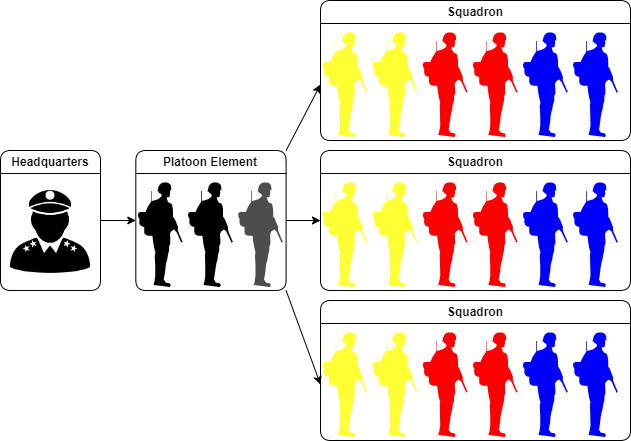

# TFO Command Structure

In order to understand how TFO functions during missions, one must understand it's command structure.
We are going to start from the top and work our way down.

### Ranks
TFO members all have military ranks, based on the U.S. Army. These ranks serve only as designations for the combat skills, and a little bit of commitment and attendance. 

Since we don't have a static unit roster, it's very much possible that someone with a lower rank is still in command. Only in the absence or downed leaders, the member of the highest rank comes in command. When a rank is refenced in this guide, we are talking about rank within the Chain of command, and not the TFO rank.

## Mission-maker 

This is usually one or two persons who prepared and created the mission, and are ultimate responsible for a good experience/performance of the mission. 

### Briefing

All missions start with a briefing done by the mission-maker for either the Platoon and/or Squad-leaders or for everyone.
During such briefings, the mission-maker is expected to give information about the objective(s), assign assets, and give other mission critical information. (insert hyperlink to briefing information). After the briefing, platoon- and squad-leader have an opportunity to ask any questions (unless stated otherwise).

## HQ

After briefing, the mission-maker remains on base and will act as the highest level of the chain of command.
HQ assigns objectives, provides (non human) support elements, handles all technical issues and also directs the enemy AI if necessary.

## Platoon element

The platoon element consists of the platoon-leader (PLT), the platoon-medic and optional an Joint terminal attack controller (JTAC) when the mission requires it. Although this element is present on the field, it does not see much combat. It's main purpose is to coordinate all Squads under it's command. With the platoon medic present in this element, it usually moves behind the battlefield to treat wounded. Usually there is only 1 platoon element, but as the unit grows, it is expected to have more than one. 

### Platoon-leader
The platoon-leader answers directly to HQ, and acts as the highest ranking officer on the field. He coordinates squads and is responsible of forming a battleplan or adapt it during the mission.

### Platoon-Medic
The Platoon-medic (or just "medic" for short) is the highest ranking medical personnel in the operation. He is more educated and capable and effective medically than it's combat life saver (CLS) counterpart and coordinates treatment of casualties with them.
With it's position in the platoon element, it can directly coordinate with the platoon-leader. 

### JTAC
 To prevent any high explosive ordinance from landing in the wrong place, all air or fire support teams require a JTAC. The JTAC is responsible for relaying and converting platoon leader's orders like "blow up that house" to something precise and effective to the support team. Often the JTAC is allowed to suggest targets or call in ordinance at their own discretion, as long as the PLT is timely noted.

## Infantry Squad
A squad is the primary asset of a platoon-leader. These teams are capable of effectively deal with objectives on their own. A full team consists of 6 soldiers, all with their own role.
Not all squads are setup with the same roles and can also be changed depending on attendance and mission requirements. all teams are made up from at least: 1 squad-leader, 1 combat lifesaver (CLS) and one rifleman varient.
the rest of the team is filled up with specialized roles like Heavy Anti-tank or automatic rifleman. 

## buddy system
To organize a squad, we utilize a system called "the Buddy System". This systems divides the squad up in 3 teams of 2 soldiers. these teams/buddies look out for each other during combat and keep each other alive.
// If you buddy would go down, You should be the first to realize this, and call it out immediately to the CLS of your team. //

## Support teams

All available support teams ultimately fall under a platoon-leader's command, however support teams are allowed to make decisions at their own discretion like relocating or engaging high priority targets. It is also possible for HQ to call the support team away for different tasking. 
