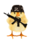
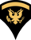
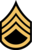
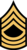
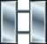

---
hide:
  - toc
---
| Ranks                   | Short | Emblem | Specialised roles | Description                                                                                                                                                                                                                                                                                                                                                                                                                    |
| ----------------------- | :-: | :-: | ----------------- | ------------------------------------------------------------------------------------------------------------------------------------------------------------------------------------------------------------------------------------------------------------------------------------------------------------------------------------------------------------------------------------------------------------------------------ |
| Recruit                 | RCT.  |  | 0                 | Fresh recruit of the unit, has not completed basic combat training. Is expected to schedule one as soon as possible. Can be kicked without warning if inactive for 1 month.  *available roles: none*                                                                                                                                                                                                             |
| Private                 | PVT.  |  | 0                 | Completed basic combat training, and is now officially a part of TFO. Is expected to stick close to the group during missions unless told otherwise and to follow it’s superior’s orders to the letter. Should orientate what role they wish to specialize in.  *available roles: rifleman*                                                                                            |
| Private First class     | PFC.  |  | 1                 | Attended several events already, And shows up regularly. Is expected to handle themselves during combat. Has earned the trust of the superior to have a little bit of free movement during engagements, but is supposed to remain within (ACRE) shouting distance.  *available roles: rifleman, anti-tank, auto rifleman, medic, marksman, grenadier*                                                                      |
| Specialist First Class  | SPC1. |  | 2                 | Has proven themselves in combat, but do not wish to lead. Is expected to expand their skillset to more specialized roles. Is allowed to move outside (ACRE) shouting distance, but is expected to coordinate this with the current squadleader.  *available roles: rifleman, anti-tank, engineer, auto rifleman, medic, marksman, sniper, grenadier*                                                                |
| Specialist Second Class | SPC2. |  | 3                 | This role provides a way of ranking up a Specialist, while not having to lead.                                                                                                                                                                                                                                                                                                                                                 |
| Specialist Third Class  | SPC3. |  | 4                 | This role provides a way of ranking up a Specialist, while not having to lead.                                                                                                                                                                                                                                                                                                                                                 |
| Master Specialist       | MSP.  |  | all               | This role provides a way of ranking up a Specialist, while not having to lead.                                                                                                                                                                                                                                                                                                                                                 |
| Corporal                | CPL.  |  | 2                 | Has been into combat enough times and has been tested for leadership. Is able to lead fireteams and a team in critical situations. The people in this rank have got all the basics down in combat. However might need more training in various situations. Has the knowledge to help other teamleaders in combat.  *available roles: teamleader, rifleman, anti-tank, engineer, auto rifleman, medic, marksman, grenadier* |
| Sergeant                | SGT.  |  | 3                 | Has leadership capabilities and knows their way with basic combat tactics. can be assigned as teamleader from the start of a mission, and will function as second in command. Able to do basic combat training for recruits.  *available roles: squadleader, teamleader, rifleman, anti-tank, engineer, auto rifleman, medic, marksman, grenadier*                                                                         |
| Staff Sergeant          | SSG.  |  | 4                 | Has proven it’s leadership capabilities and can be assigned as a squadleader to lead an squad through a mission.  *available roles: squadleader, teamleader, rifleman, anti-tank, engineer, auto rifleman, medic, marksman, grenadier*                                                                                                                                                                                     |
| Master Sergeant         | MSG.  |  | all               | Can create a battle-plan for several squads during an operation. Their main job is to assist the commander in the discipline and welfare of the enlisted men. Can take care of day to day business within the unit.  *available roles: platoonleader, squadleader, rifleman, anti-tank, engineer, auto rifleman, medic, marksman, grenadier*                                                                               |
| Second Lieutenant       | 2LT.  |  | all               | Proven themselves capable of making community decicions without asking for approval. Is responsible for unit cohesion and thinks about long-term concequences. expected to always put the need of the unit before themselves.  *available roles: platoonleader, squadleader, rifleman, anti-tank, engineer, auto rifleman, medic, marksman, grenadier*                                                                        |
| First Lieutenant        | 1LT.  |  | all               | Expected to advice the captains where needed. Takes command of the whole unit in the absence of a captain.  *available roles: platoonleader, squadleader, rifleman, anti-tank, engineer, auto rifleman, medic, marksman, grenadier*                                                                                                                                                                                           |
| Captain                 | CPT.  |  | all               | Second highest rank achievable in the unit. Currently reserved for the unit founders. Expected to attend as much as possible.  *available roles: platoonleader, squadleader, rifleman, anti-tank, engineer, auto rifleman, medic, marksman, grenadier*                                                                                                                                                                        |
| Major                   | MAJ.  |  | all               | In this unit the highest rank. Currently reserved for the unit founders. Expected to attend as much as possible.  *available roles: platoonleader, squadleader, rifleman, anti-tank, engineer, auto rifleman, medic, marksman, grenadier*                                                                                                                                                                                     |